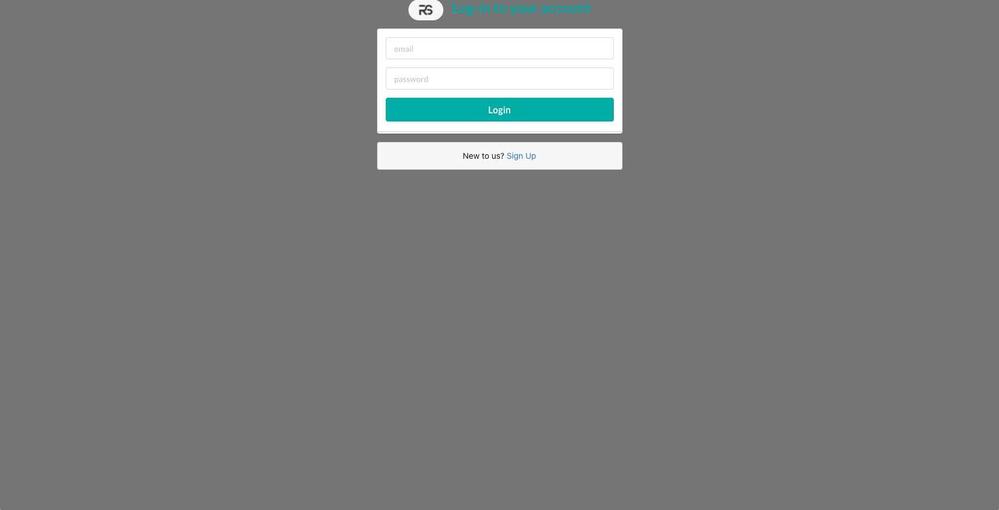
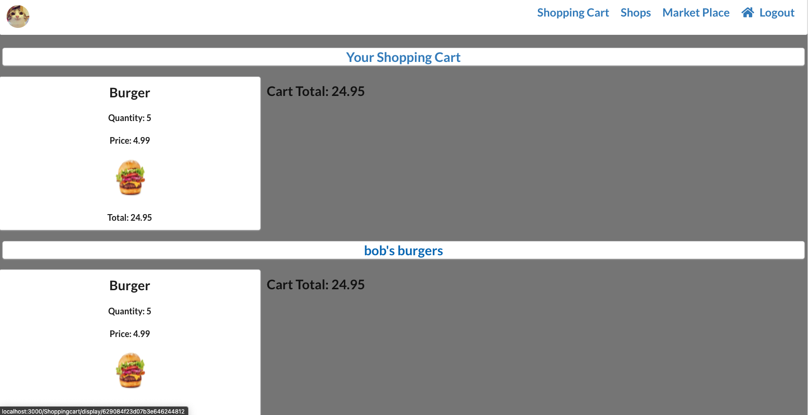
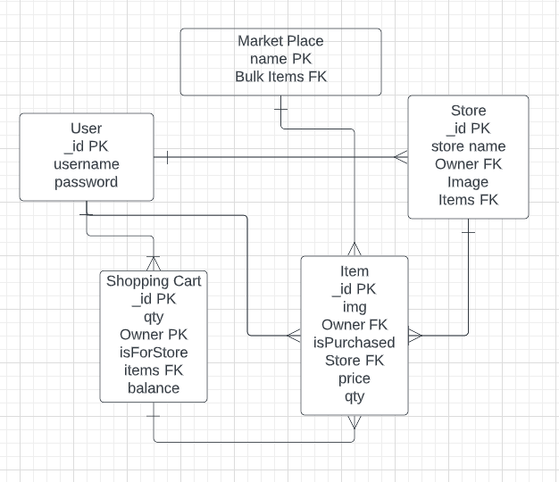
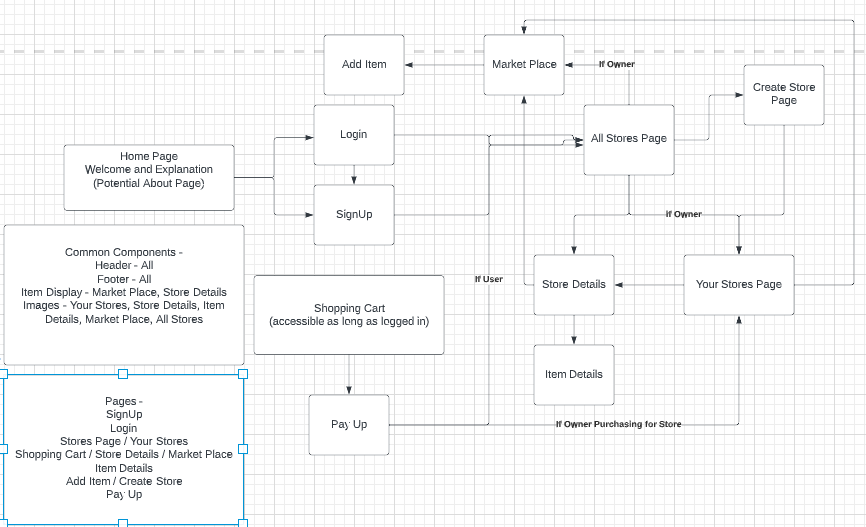

<h1> Retail Stores App! </h1>

 This application mimics the role that shopify plays to individual store owners and creators. Users are able to create stores and edit the
content that each store contains. 

<h3> Login Page </h3>

<h3> All Stores Page </h3>

<h3> MarketPlace! </h3>
 
 <h3> Example Shopping Cart </h3>
  
     

<h2> Data Model </h2>

<h2> WireFrame </h2> 

     
<h2> Routes </h2>
     
     
Technologies Used: JavaScript, Html, Css, React.js, Express.js, Node.js, AWS, Semantic-UI, Atlas, Heroku, JSON WebToken Authentication, MongooseDB

Deployed On Heroku
Here's The Link!
<a href="https://retail-stores-ams.herokuapp.com/"> Retail Stores App! </a>
 
<h2> Stretch Goals </h2>
<ul>
  <li>Settle Up A Cart With A Paypal API</li>
  <li>Make Items in ShoppingCart Returnable</li>
  <li>Actively edit quantities in shopping Cart</li>
  <li>Incorporate an individual purchaser from stores</li>
  <li> Restrict marketplace access </li>
</ul
